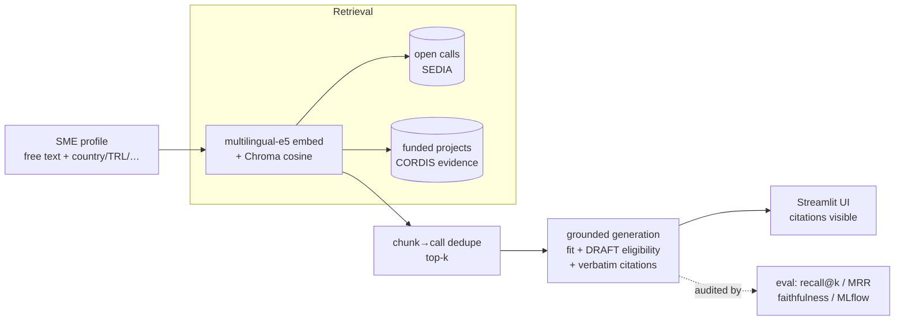

# RAISE — SME Grant Finder

**Describe your project in plain language → get matching open EU funding calls, each with a
source-grounded fit summary, a draft eligibility snapshot, and clickable citations.**

A retrieval-augmented system that helps non-expert SMEs find and pre-assess relevant EU
funding calls. It mirrors the source-grounded-RAG-for-SME-enablement work of the
**DFKI RAISE** group.

```
┌─ RAISE — SME Grant Finder ───────────────────────────────────────────┐
│ ⚠ Decision-support draft — eligibility is indicative, verify against  │
│   the official call documents. Not a legal verdict.                   │
├──────────────────────────────────────────────────────────────────────┤
│ Project: "German SME, AI predictive-maintenance for manufacturing…"   │
│ Country: DE   Type: SME   TRL: 6        [ 🔎 Find calls ]             │
├──────────────────────────────────────────────────────────────────────┤
│ 1. Industrial leadership in AI, Data and Robotics      match 0.819    │
│    deadline 2026-09-… · HORIZON-IA      [Open the official call ↗]    │
│    Why it may fit: the call targets industrial AI/robotics uptake …   │
│    ▸ fit evidence  «…boosting competitiveness and the green …» [src↗] │
│    Eligibility (draft — 1 stated condition):                          │
│      ❔ Eligible Countries — unclear, verify                          │
│         «Eligible Countries described in section 6 …»        [src↗]   │
│    To verify: budget ceiling · consortium rules · TRL expectation     │
└──────────────────────────────────────────────────────────────────────┘
```
*(Live UI: `streamlit run app.py` then open `http://localhost:8501/?demo=1`. Drop a real
screenshot at `docs/screenshot.png`.)*

## The problem

EU funding calls are dense and written for experts, and hundreds are open at any time. A
small or medium company with a good project struggles to find the few relevant open calls,
then judge whether it's eligible, without paying a consultant. RAISE turns a free-text
project description into a ranked, cited shortlist so the SME can decide what to read in full.

## Architecture



SME profile → retrieve (open calls + funded-project evidence) → grounded generation
(fit + draft eligibility + citations) → eval. The UI is a thin shell over
`pipeline.run()`.

## Data sources (open data)

| Source | What | Count |
|--------|------|-------|
| EU F&T Portal (SEDIA) | live open funding calls | 449 calls → 1025 chunks |
| CORDIS | past Horizon Europe funded projects (evidence) | 400 projects (392 SME-involved) → 457 chunks |

Both are public EU open data. Full call/project text is kept verbatim so claims can be cited
back to source. (Large dumps are gitignored; small `data/samples/` ship with the repo.)

## Key design choices

- **Multilingual embeddings** (`intfloat/multilingual-e5-base`): SME text is often German,
  and call text spans EU languages. e5 task prefixes (`passage:`/`query:`) applied in one place.
- **Chunk → call dedupe**: over-fetch chunks, keep each call's best-scoring chunk, rank
  calls by it. One row per call.
- **Code-enforced citation grounding**: the generator's snippets don't get trusted as
  written. The code re-derives each to the verbatim source span (longest contiguous match)
  and drops anything fabricated or stitched. A claim without a source never ships.
- **Eligibility is assistive, never a verdict**: per-condition assessment is
  `yes` / `unclear` only (no hard "no"), and unknowns go to a "to verify" list. The tool
  won't say "you are (not) eligible".

## Results

See [`notes/results.md`](notes/results.md); eval code in `src/eval_*.py`.

| Metric | Value |
|--------|-------|
| Citation grounding (snippet is exact source substring) | **98.1%** (53/54; the 1 miss is a tokenizer artifact, not a fabrication) |
| Faithfulness — LLM-judge supported (`yes`) | 44.4% |
| Faithfulness — supported or partial | **85.2%** |
| Retrieval — dense (pool-relative) | MRR **0.67**, recall@10 **0.70**, prec@5 0.42 |
| Retrieval — hybrid (BM25+dense, RRF) | MRR **0.70**, recall@10 **0.78**, beats dense in the tail |

Grounding holds up under attack. An adversarial 21-agent audit of the generation output
caught 5 fabricated *fit* quotes that a naive fuzzy check had hidden. After switching to
verbatim span re-derivation, ~100% of surviving citations are exact source text and no
fabricated eligibility condition survived. The pipeline drops a claim rather than ship it
ungrounded.

## Relation to RAISE (DFKI)

Source-grounded RAG for non-expert SME enablement, the group's theme. It mirrors their
stack: a ragold-style relevance-judged gold eval (labels AI-drafted then human-reviewed,
not auto-graded by the retrieval model itself), a forced-citation generation pattern (cf.
hivegent), and a dense-vs-hybrid config benchmark logged to MLflow. That benchmark is a
small step toward experience-based / CBR-style config selection (cf. cbrkit): picking the
retriever per query type from logged outcomes.

## Limitations

- **Small, AI-drafted + single-reviewer gold set** (10 profiles, 200 judgments; an assistant
  drafted the labels, the author reviewed them): indicative, not publication-grade, with no
  inter-annotator agreement.
- **English-dominant corpus**: it under-exercises the multilingual embedder.
- **Eligibility is not a legal verdict**: treat it as a drafting aid and verify the call documents.
- **Calls are a snapshot**: the open-call set changes, so rebuild the index to refresh.
- **Local 7B generator** fabricates ~half its fit quotes (then dropped), so some calls show
  no fit citation. A stronger model is the obvious lever.

## Run it

**Prereqs:** Python 3.13 (torch/chromadb lack 3.14 wheels) and, for live generation,
[Ollama](https://ollama.com) with a model pulled (`ollama pull qwen2.5:7b`).

```bash
# 1. setup
make setup                      # venv-index (py3.13) + pip install -r requirements.txt

# 2. demo UI — no index, no LLM needed
make demo                       # then open http://localhost:8501/?demo=1

# 3. full pipeline
python src/fetch_sedia.py       # (optional) refresh the open-calls corpus
python src/load_cordis.py       # (optional) refresh the funded-project corpus
make build-index                # build the Chroma index (data/chroma/)  ← REQUIRED before live use
ollama pull qwen2.5:7b          # the default generation model
make run-app                    # full UI at http://localhost:8501

# 4. evaluation
make gold                       # generate data/gold/to_label.csv → label it → save labeled.csv
make run-eval                   # recall@k / MRR + faithfulness
make benchmark                  # dense vs hybrid, logged to ./mlruns
```

**Docker** (serves the app; mount `data/` for the index, point at host Ollama):

```bash
docker build -t raise-app .
docker run --rm -p 8501:8501 raise-app                      # demo mode: open ?demo=1
docker run --rm -p 8501:8501 \
  -e OLLAMA_HOST=http://host.docker.internal:11434 \
  -v "$PWD/data:/app/data" raise-app                        # full pipeline
```

**Config / secrets:** backend is `config.LLM_BACKEND` (`ollama` default; `anthropic`
optional, reads `ANTHROPIC_API_KEY` from env, never committed). `OLLAMA_HOST` /
`OLLAMA_MODEL` are env-overridable.

## Repo layout

```
app.py                 thin Streamlit UI over pipeline.run()
src/  config · schema · retrieve · generate · pipeline · llm · build_index · eval_*
data/samples/          small sample corpora + cached demo shortlist (for demo mode)
data/gold/             eval set: profiles, candidates, AI-drafted+reviewed labels, metrics
notes/                 results.md · writeup.md · scope.md · day*.md gate reports
```
